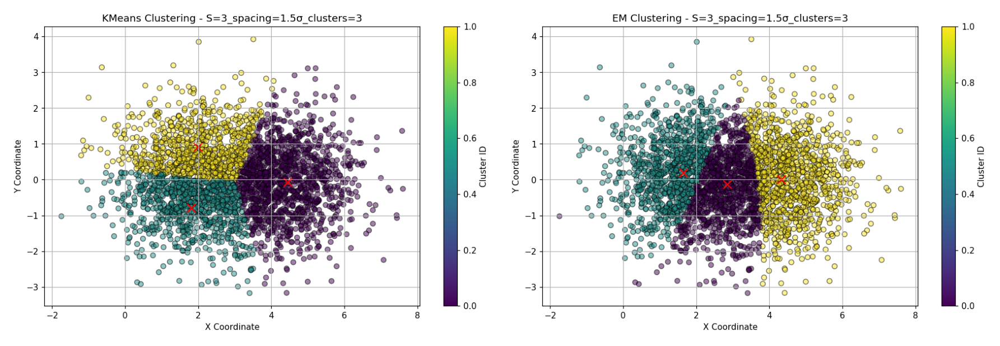
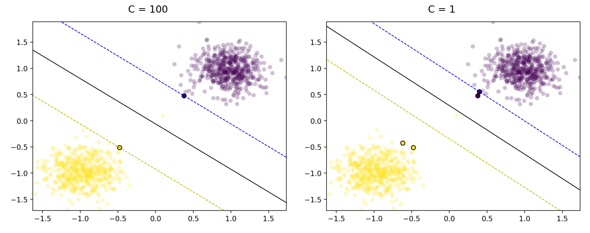
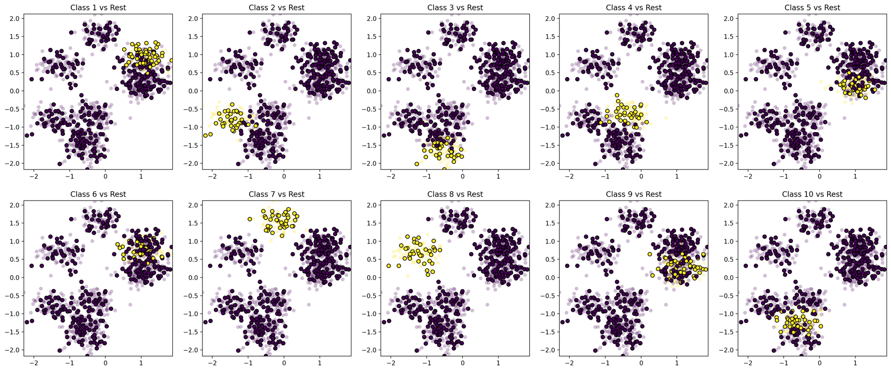

# ML Coursework

Machine learning algorithms I implemented from scratch for **CS-7003**, a graduate course at
The University of Tulsa (2024). Each folder is one course project and is self-contained.

| Folder | What's inside |
|---|---|
| [`neural-networks/`](neural-networks) | A NumPy multilayer perceptron with backpropagation and momentum, tested on XOR, M-of-N and identity-mapping tasks, plus a PyTorch network for LED digit recognition with k-fold cross-validation |
| [`unsupervised-learning/`](unsupervised-learning) | K-means and EM for Gaussian mixtures, compared on synthetic data and MNIST, and k-means applied to image color compression |
| [`random-forest/`](random-forest) | Decision trees and a random forest built from scratch in a notebook |
| [`svm-smo/`](svm-smo) | A support vector machine trained with Sequential Minimal Optimization with several kernels, evaluated on synthetic data and the UCI Adult dataset |

## Selected results

<p align="center">
  
  <br><em>k-means (left) and EM for Gaussian mixtures (right) on the same three Gaussian sources; red crosses mark the fitted centers.</em>
</p>

<p align="center">
  
  <br><em>Linear SVM trained with SMO on two clusters plus one outlier, at C = 100 and C = 1; circled points are support vectors.</em>
</p>

<p align="center">
  
  <br><em>One-vs-rest multiclass SVM on ten clusters, one SMO classifier per class.</em>
</p>

## Running

```bash
pip install numpy scipy matplotlib scikit-learn pillow torch jupyter
cd neural-networks && python XOR.py
```

Scripts in `unsupervised-learning/` and `neural-networks/` import helpers from their own folder, so run them from inside that folder.

## Acknowledgements

- The SMO notebook builds on John Platt's [original SMO paper](https://www.microsoft.com/en-us/research/wp-content/uploads/2016/02/tr-98-14.pdf) and Jon Charest's [SVM/SMO tutorial](https://jonchar.net/notebooks/SVM/).
- The random forest notebook follows common from-scratch decision tree tutorials.
